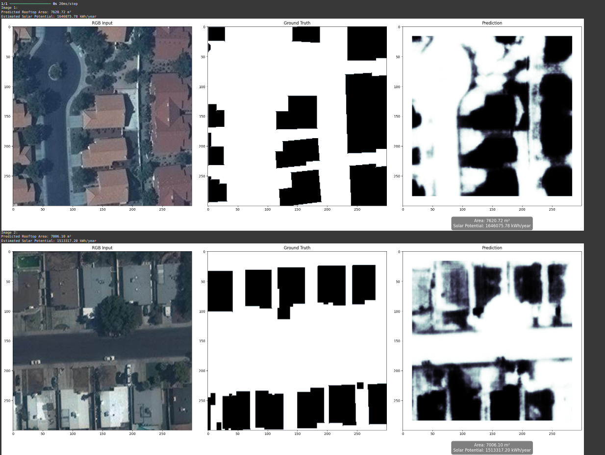
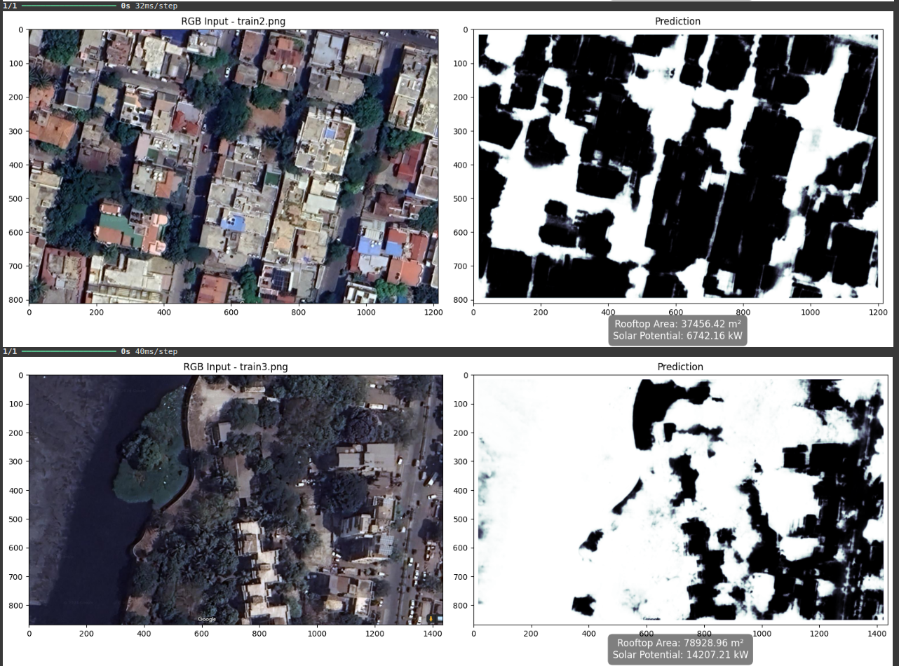

# Rooftop Solar Energy Potential Map Using Machine Learning and Deep Learning

## Overview
This project aims to generate a solar energy potential map by extracting building rooftops from satellite imagery using machine learning and deep learning techniques. The core focus is on building footprint extraction using two Convolutional Neural Network (CNN)-based segmentation models: a custom CNN and a UNet-based architecture. The segmented rooftop areas are used to estimate potential solar energy generation by combining rooftop area calculations with solar radiation data and panel efficiency assumptions.

## Project Objectives
- Extract building rooftops from satellite images using CNN-based segmentation models.
- Estimate rooftop areas and calculate potential solar energy generation.
- Visualize predicted rooftop segments against ground truth for comparison.
- Provide usable rooftop area estimates for solar panel installation.

## Methodology
### Data Preparation
- **Dataset**: Satellite images with corresponding annotations in JSON format.
- **Preprocessing**: Annotations and image metadata are merged using Pandas DataFrames for efficient handling.

### Segmentation Models
Two CNN models were developed using Keras:
1. **CNN1**: A custom model with convolutional layers, batch normalization, dropout, and ELU activation functions to effectively capture rooftop structures.
2. **CNN2**: A UNet-based architecture with transposed convolutions for upsampling, enabling high-resolution segmentation of fine-grained details.

Both models output binary segmentation masks, with probability scores indicating rooftop presence. The Dice coefficient is used as the primary evaluation metric.

### Training
- **Loss Function**: A custom loss combining binary cross-entropy and Dice coefficient.
- **Callbacks**: EarlyStopping, ReduceLROnPlateau, and ModelCheckpoint to optimize training.
- **Data Loading**: A batch generator efficiently loads images and segmentation masks.
- **Evaluation**: Models are trained and validated using ground truth masks, with the best weights saved based on validation loss.

### Post-Processing
- **Rooftop Area Calculation**: Pixel counts from segmentation masks are converted to real-world measurements (square meters) using the image's spatial resolution (meters per pixel).
- **Solar Energy Potential**: Estimated using the formula:  
  `Energy = Rooftop Area × Solar Irradiance × Panel Efficiency`  
  - **Solar Irradiance**: Assumed as 1000 W/m² (location-specific values can be used).  
  - **Panel Efficiency**: Typically 15–20%.

## Implementation
- **Libraries**: NumPy, Pandas, scikit-image, Matplotlib, and Keras for data handling, image processing, and model building.
- **Training**: Performed using Keras, with model weights saved based on validation performance.
- **Area Calculation**: Pixel-wise area estimation based on segmentation output and image resolution.

## Results
The models successfully segment building rooftops from satellite imagery, with CNN2 (UNet-based) providing finer details due to its architecture. The calculated rooftop areas are used to estimate solar energy potential, enabling practical applications for solar panel installation planning.

### Output Screenshots
Below are example outputs from the project. (Replace the placeholders with actual screenshots by uploading them to the GitHub repository and updating the paths.)

  
*Caption*: Comparison of predicted rooftop segmentation (left) and ground truth (right).

  
*Caption*: Visual representation of the solar energy potential map based on segmented rooftop areas.
